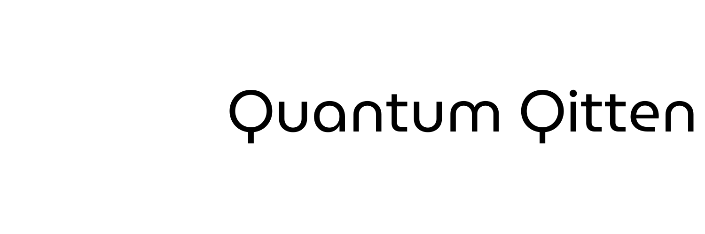

# Dashboard IT Quantique

## Description

Le Dashboard IT Quantique est une interface de supervision innovante conçue pour monitorer et gérer une infrastructure IT basée sur des technologies quantiques fictives. Ce projet combine des éléments de science-fiction avec des concepts réels de supervision IT pour créer une expérience utilisateur unique et futuriste.

## Fonctionnalités principales

- 🖥️ **Surveillance en temps réel** des métriques quantiques (qubits actifs, niveau d'intrication, taux de décohérence)
- 🔄 **États superposés des serveurs** affichant simultanément les états opérationnels et défectueux
- ⏳ **Timeline quantique** visualisant les événements passés, présents et futurs de l'infrastructure
- 🤖 **Assistant IA intégré (MIW)** pour des interactions contextuelles sur l'état du système
- 📊 **Graphiques dynamiques** montrant l'évolution des métriques clés

## Aperçu

## Installation

Pour installer et exécuter ce dashboard localement, suivez ces étapes :

1. Clonez le repository :

`git clone https://github.com/MeltingBot/dashboard.git`

2. Naviguez dans le dossier du projet :

`cd quantum-it-dashboard`

3. Installez les dépendances :

`npm start`

L'application devrait maintenant être accessible à l'adresse [http://localhost:3000](http://localhost:3000).

L'application devrait maintenant être accessible à l'adresse [http://localhost:3000](http://localhost:3000).

## Utilisation

Une fois l'application lancée, vous pouvez :

- Observer les métriques quantiques en temps réel sur le dashboard principal
- Interagir avec les différents composants pour obtenir plus d'informations
- Utiliser le chat IA (MIW) pour poser des questions sur l'état du système
- Explorer la timeline pour voir les événements passés et futurs prédits

## Technologies utilisées

- React.js
- Recharts pour les graphiques
- Lucide React pour les icônes
- CSS-in-JS pour le styling

---

Développé avec ❤️ et une pincée de magie quantique.
